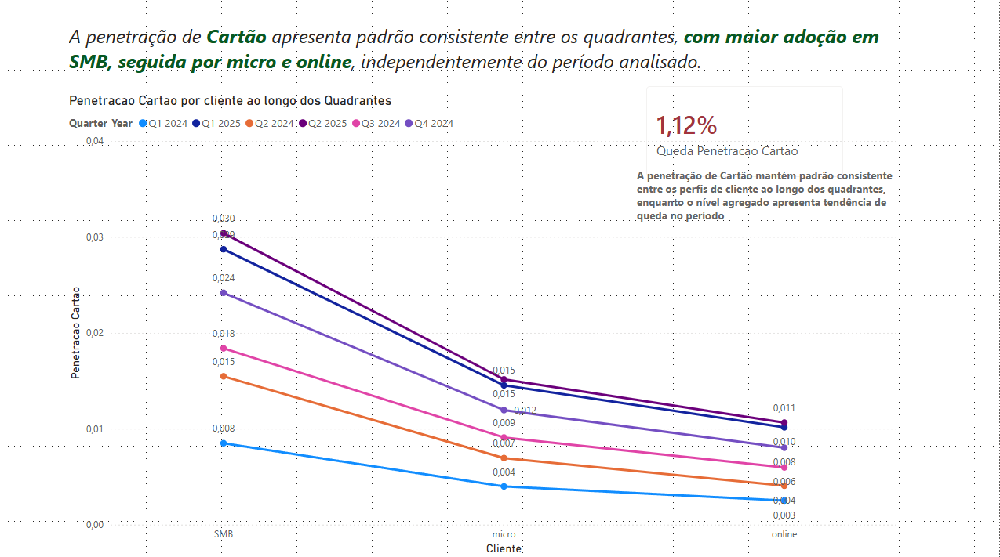

# 📊 SmartCash Penetration & Recurrence Analysis

## 📌 Context
Este projeto analisa a queda de penetração de meios de pagamento (Cartão, Pix e SmartCash) ao longo do tempo, com foco em recorrência, inatividade de clientes e concentração de receita.

A base utilizada é fictícia e o objetivo do projeto é exclusivamente analítico.

---

## ❓ Perguntas de Negócio
- A queda de penetração está associada à redução de ticket médio?
- Quem são os clientes que se tornam inativos?
- A perda de penetração vem de perda de valor ou de recorrência?
- Existe concentração excessiva de receita em determinados perfis?

---

## 🔍 Principais Insights
- A queda de penetração **não é explicada por redução de ticket médio**, especialmente em SmartCash.
- O principal fator é a **diminuição da recorrência de uso**.
- Parte relevante da receita vinha de clientes que posteriormente se tornaram inativos.
- Clientes inativos mantinham **saldo médio relevante**, indicando perda de engajamento e não incapacidade financeira.
- A receita de SmartCash apresenta **alta concentração em SMB**, criando dependência estrutural.

---

## 🛠️ Tecnologias e Técnicas
- Power BI
- DAX (QoQ, acumulados, medidas de penetração)
- Modelagem de dados
- Análise temporal
- Storytelling orientado a negócio

---

## 📈 Outputs
- Dashboard interativo (PBIX)
- Relatório executivo (PDF)
- Visualizações de penetração, ticket médio, inatividade e concentração de receita

---

## 📷 Exemplos de Visualização

---

## 👤 Autor
Juan Ayres Melo  
Data & AI | Analytics | Business Intelligence
